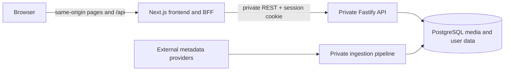

# OmniMediaTrak Frontend

OmniMediaTrak is a personal full-stack media tracker for books, anime, games, and other media in one searchable catalog and user-managed list. This repository is the public Next.js/TypeScript presentation layer.

The Fastify/PostgreSQL backend and the custom data-ingestion/database-building pipeline are private, proprietary work. Their interfaces and behavior are summarized here so the frontend can be evaluated without exposing that implementation.

## Current Status

This is an actively developed private alpha. The public frontend currently
demonstrates catalog browsing and filtering, media details and tracking,
registration/login/logout, profiles and account rights controls, named and
shared static/dynamic collections, privacy-thresholded recommendations, and support intake.
It is not a hosted production service.

| Home | Catalog |
|---|---|
|  |  |

## Architecture



Only the left-hand frontend is published in this repository. See [Architecture and Public Boundary](docs/architecture.md) for the intentionally limited interface-level view.

## Design References

- [Dark mode design comparison](docs/dark-mode-design-comparison.md): original CS2800 theme compared with the current frontend, including palette, component, and design-decision tables.

## API Route List

Frontend integrates with these backend routes:

Auth

- `POST /auth/register`
- `POST /auth/login`
- `POST /auth/logout`
- `GET /auth/me`
- `GET /auth/username-available`
- `POST /auth/email/verification/request`
- `POST /auth/email/verification/confirm`
- `POST /auth/password/change`
- `GET /auth/sessions`
- `POST /auth/sessions/revoke-others`

Media

- `GET /media`
- `GET /media/facets`
- `GET /media/:id`
- `POST /media`
- `PUT /media/:id`
- `PATCH /media/:id`
- `DELETE /media/:id`

List

- `POST /list/membership`
- `POST /list`
- `GET /list/:mediaId`
- `PATCH /list/:mediaId`
- `DELETE /list/:mediaId`
- `GET|POST /lists`
- `GET|POST|PUT|DELETE /lists/:listId/items[/mediaId]`
- `GET|POST|DELETE /lists/:listId/shares[/userId]`
- `POST /lists/:listId/share-links`
- `GET|POST /lists/share-links/:token[/accept]`
- `GET|POST|DELETE /connections[/requests]`

Profile, recommendations, and support

- `GET|PATCH|DELETE /profile`
- `GET /profile/export`
- `GET /trends/related/:mediaId`
- `POST /support/contact`

## Setup Instructions

From the `frontend/` directory:

```bash
npm install
npm run dev
```

Default local URL: `http://localhost:3000`

The frontend can be inspected without the private backend, but catalog records,
authentication, and personal-list operations require a compatible API
implementing the contract below. It does not substitute fictional records when
the API is unavailable.

## Environment Variables

- `INTERNAL_API_BASE_URL`: server-only Fastify URL used by Next.js and the
  same-origin BFF; local default is `http://localhost:3001`.
- `NEXT_PUBLIC_API_BASE_URL`: optional browser override for special local
  development. Leave unset in hosted environments so browser calls use `/api`.
- `TRUSTED_PUBLIC_HOSTS`: comma-separated exact hosts accepted by the BFF in
  the selected deployment.

The private API and database do not need public browser-facing endpoints.

## Stack

- Next.js (App Router)
- React
- TypeScript
- CSS

## Assets

Fonts and images used by the frontend are under `public/` (e.g. `public/fonts`, `public/images`). If fonts are missing, update `app/globals.css` or convert TTF→WOFF2 as needed.

## Pages

- / (home)
- /catalog (media catalog + filters)
- /list (All Media, static/dynamic collections, and sharing)
- /list/invite/[token] (private collection invitation acceptance)
- /media/[id] (media details and tracking)
- /account (profile, trend consent, export, deletion)
- /privacy
- /contact
- /auth/register
- /auth/login
- /auth/logout
- /auth/verify-email

## Validation

```bash
npm run lint
npm run typecheck
npm run build
```

Automated browser/component tests are not configured yet. The commands above are the current static and production-build checks.

## Ownership and Use

Brandon Walker designed and implemented this frontend and the private backend/database pipeline as a personal continuation of an earlier course prototype. The initial repository scaffolding came from GitHub Classroom; the current application and portfolio presentation are Brandon's work.

This repository is public for inspection and portfolio review only. Brandon Walker's original OmniMediaTrak code and documentation are **all rights reserved**; no permission is granted to copy, modify, redistribute, deploy, or create derivative works without prior written permission. See the [proprietary notice](LICENSE). Third-party dependencies, assets, and pre-existing scaffolding retain their own terms.
