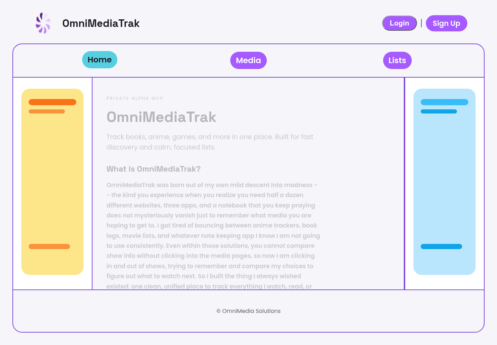
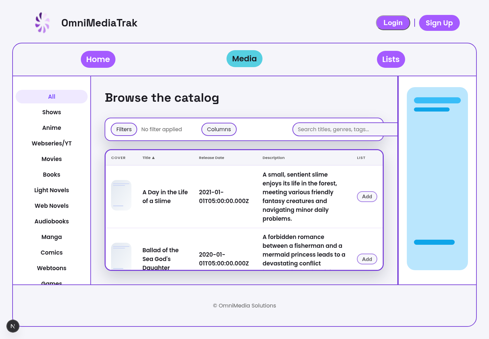
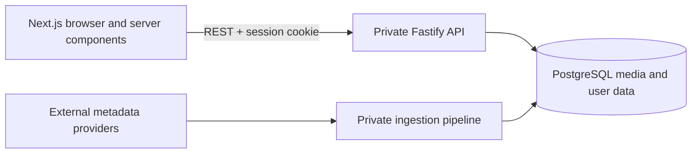

# OmniMediaTrak Frontend

OmniMediaTrak is a personal full-stack media tracker for books, anime, games, and other media in one searchable catalog and user-managed list. This repository is the public Next.js/TypeScript presentation layer.

The Fastify/PostgreSQL backend and the custom data-ingestion/database-building pipeline are private, proprietary work. Their interfaces and behavior are summarized here so the frontend can be evaluated without exposing that implementation.

## Current Status

This is an actively developed private-alpha MVP. The public frontend currently demonstrates catalog browsing and filtering, registration/login/logout flows, authenticated list retrieval and removal, responsive navigation, and fallback content when the API is unavailable. It is not a hosted production service.

| Home | Catalog |
|---|---|
|  |  |

## Architecture



Only the left-hand frontend is published in this repository. See [Architecture and Public Boundary](docs/architecture.md) for the intentionally limited interface-level view.

## API Route List

Frontend integrates with these backend routes:

Auth

- `POST /auth/register`
- `POST /auth/login`
- `POST /auth/logout`
- `GET /auth/me`

Media

- `GET /media`
- `GET /media/:id`
- `POST /media`
- `PUT /media/:id`
- `PATCH /media/:id`
- `DELETE /media/:id`

List

- `GET /list`
- `POST /list`
- `DELETE /list/:mediaId`

## Setup Instructions

From the `frontend/` directory:

```bash
npm install
npm run dev
```

Default local URL: `http://localhost:3000`

The home and catalog pages contain fallback records and can be inspected without the private backend. Authentication and personal-list operations require a compatible API implementing the contract below.

## Environment Variable Requirements

- `NEXT_PUBLIC_API_BASE_URL` (default: `http://localhost:3001`)

## Stack

- Next.js (App Router)
- React
- TypeScript
- CSS

## Assets

Fonts and images used by the frontend are under `public/` (e.g. `public/fonts`, `public/images`). If fonts are missing, update `app/globals.css` or convert TTF→WOFF2 as needed.

## Pages

- / (home)
- /catalog (media catalog + filters)
- /list (personal list)
- /auth/register
- /auth/login
- /auth/logout

## Validation

```bash
npm run lint
npm run typecheck
npm run build
```

Automated browser/component tests are not configured yet. The commands above are the current static and production-build checks.

## Ownership and Use

Brandon Walker designed and implemented this frontend and the private backend/database pipeline as a personal continuation of an earlier course prototype. The initial repository scaffolding came from GitHub Classroom; the current application and portfolio presentation are Brandon's work.

This repository is public for inspection and portfolio review only. Brandon Walker's original OmniMediaTrak code and documentation are **all rights reserved**; no permission is granted to copy, modify, redistribute, deploy, or create derivative works without prior written permission. See the [proprietary notice](LICENSE). Third-party dependencies, assets, and pre-existing scaffolding retain their own terms.
